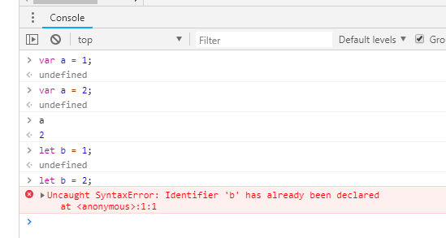

## 1.1 var 与 let 关键字

### 1.1.1 let 关键词与 var 关键词的主要区别

1. var 会对定义变量进行作用域提升（hositing 机制），而 let 不会，定义后的变量会放置到临时死区（TDZ）；

```javascript
    
    function func(){
        var a = 1;

        console.log(a);// a = 1
        console.log(b);// 作用域提升，没有赋值，undefined
        // console.log(c);
        if(a){
            var c = 5;//作用域提升
        }
        // console.log(d);//未定义，抛出异常
        var b ;
        console.log(c);// c = 5    作用域提升
    }

    func();


```
2. 作用域范围不一致。let 是块级作用域，var 的作用域是函数内部；

```javascript

    function func (){
        var a = 1;

        if(a > 0){
            let b = 2;
        }

        console.log(a);// a = 1
        console.log(b);// b = undefined
    }

    func();

    console.log(a);// a = undefined
    console.log(b);// b = undefined


```

3. var 可以对同一变量重复定义，以最新定义的为准。let 不行，重复定义会抛出异常。

```javascript

    function func(){

        var a = 1;
        var a = 3;

        console.log(a);// a = 3;
    }

    function test(){

        let a = 1;
        let a = 2; // javascript 引擎解释执行的时候回直接抛出错误
    }

```



### 1.1.2 关键词 let 与 const

const 和 let 都是 ES6 新引入的关键字，用来定义变量。

**区别：** const 定义的变量的作用域与 let 一致。两者的区别在于，const 是常量定义，定义时赋值初始化，之后不可更改。更改时会抛出异常。

## 1.2 临时死区 TDZ

let ,const 在进行变量定义的是后，不会提升作用域。

js 在解释执行之前，引擎会扫描一遍代码，遇见 var 定义的变量 a ，会把变量提升到作用域的顶部；在遇见 let 或 const 定义的变量 b ，会把该变量放置到临时死区（TDZ）。

代码在解释执行的时候，遇到变量 b 的时候，此时 b 还有定义，此时的变量 b TDZ 中，因此解释器会抛出异常。当代码执行到定义变量 b 的地方，变量 b 会从临时死区中移出，变量 b 可以正常的访问。


## 1.3 IIFE 与 let , const

在 for 循环中，使用 var 定义变量是，在循环块中会共享同一变量的作用域。

```javascript

    var queue = [];
    for(var i = 0 ;i < 10 ; i ++){
        queue.push(function(){
            console.log(i);
        });
    }

    for(var j = 0; j < queue.length ;j ++){
        queue[j]();
    }
    //最终打印 10 10 10 10 10 10 10 10 10 10
    //queue 数组的各个函数，始终引用的是变量 i ,第一个 for 循环执行完毕之后，i 已经变成了10。
    //最终各个函数，打印出来的变量 i ,其实是同一个 i,也就是 10
```

1. IIFE 方式，强制隔离，每个函数都是一个独立的作用域，不会共享同一个变量空间的 i

    IIFE 也是**闭包**运用的一种方法。

```javascript

    var queue = [];
    for(var i = 0 ;i < 10 ; i ++){
        queue.push(function(){
            console.log(i);
        });
    }

    for(var j = 0; j < queue.length ;j ++){
        queue[j]();
    }

    //最终打印 0 1 2 3 4 5 6 7 8 9
```

2. 使用更简便的方法，定义迭代变量使用 let 或 const 替代。

    let ,const 每次die

```javascript

    var queue = [];
    for(let i = 0 ;i < 10 ; i ++){

        // 把迭代的变量 i 的值，传递到函数内部。函数内部有独立的作用域

        queue.push((function(val){
            console.log(val);
        })(i));

    }

    for(var j = 0; j < queue.length ;j ++){
        queue[j]();
    }
    //最终打印 0 1 2 3 4 5 6 7 8 9

```
