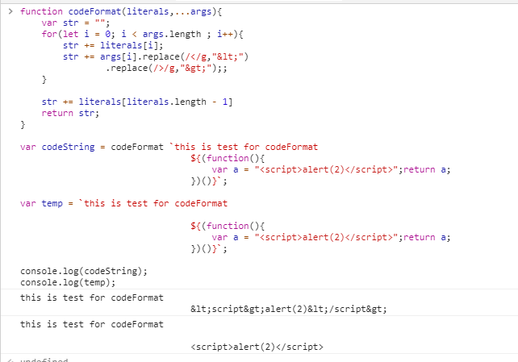

## 1.2 模板字面量

### 1.2.1 特性

1. 支持字符串的格式化输出；
   弥补以前 ES5 语法的不足，需要使用字符串拼接，来完成字符串格式化输出。计较两种字符串输出方式：

2. 支持换行，缩进；

3. 支持占位符输出，占位符的内容可以是变量，函数表达式等。语法上使用 `${内容}`  组成。


   ```javascript
   
   var fruits = ["apple","orange","banana"];
   
   //1. 
   var html = "<div><ul>"+
       			"<li>"+fruits[0]+"</li>"+
       			"<li>"+fruits[1]+"</li>"+
       			"<li>"+fruits[2]+"</li>"+
       		"</ul></div>";
   console.log(html);
   
   //2.
   
   var html2 = `<div>
   				<ul>
   					<li>${fruits[0]}</li>
                       <li>${fruits[1]}</li>
                       <li>${fruits[2]}</li>
   				</ul>
   			</div>`;
   
   	console.log(html2);
   
   ```

### 1.2.2  标签模板


标签模板是字面量的一个强大的功能，也是做突出的意义所在。可以实现字符串的原生输出。


1. 定义模板标签

   模板标签就是一个函数，第一个参数是一个数组，用来接收**解释过后**的字面量字符串，之后的参数依次分别是传入的**解释后的**占位符变量。

2. 实现字符串的转义输出

   ```javascript
   function codeFormat(literals,...args){
       var str = "";
       for(let i = 0; i < args.length ; i++){
           str += literals[i];
           str += args[i].replace(/</g,"&lt;")
                   .replace(/>/g,"&gt;");;
       }
       
       str += literals[literals.length - 1]
       return str;
   }
   
   var codeString = codeFormat `this is test for codeFormat
   								${(function(){
                                       var a = "<script>alert(2)</script>";return a;
                                   })()}`;
   
   var temp = `this is test for codeFormat
   								
   								${(function(){
                                       var a = "<script>alert(2)</script>";return a;
                                   })()}`;
   
   console.log(codeString);
   console.log(temp);
   
   
   ```

   